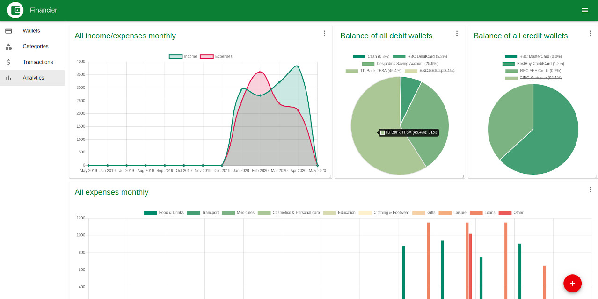
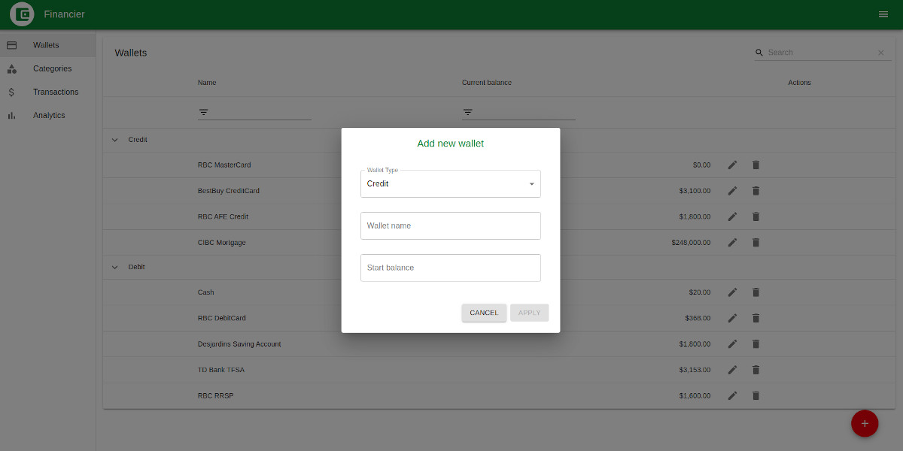
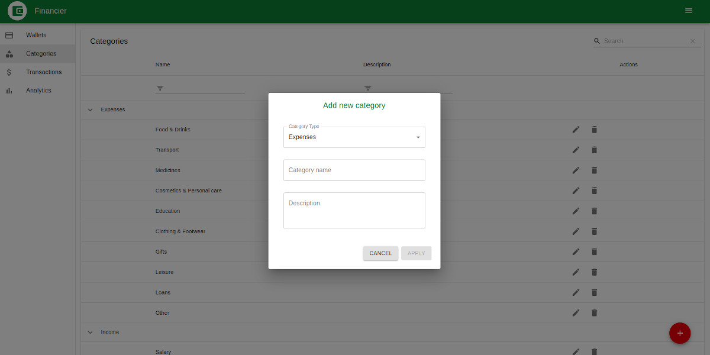
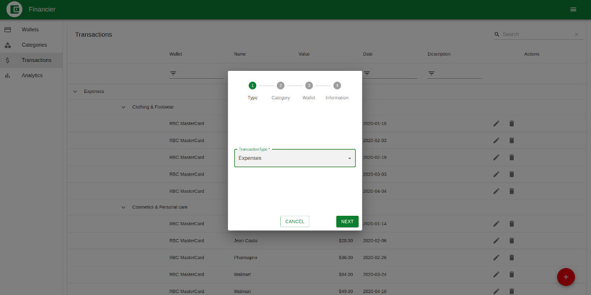
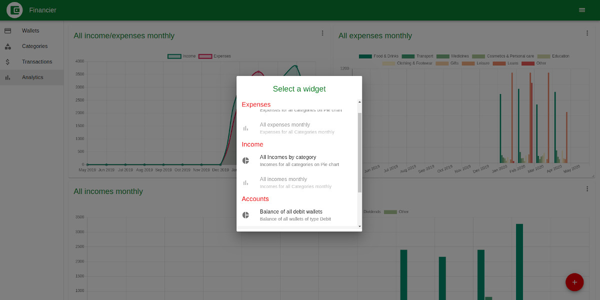

# Financier

*02 May 2020*

You can see the demo version of this application [here ...](https://maksimkotau.github.io/financier/ "Financier web application")

This is a demo version of the home finance accounting application.

The application has four screens:

* Categories
* Wallets
* Transactions
* Analytics

On the Wallets page, you can create wallets / accounts of two types: Credit or Debit. Credit wallets are for example Credit cards, Credit lines, mortgages (in other words: the money you borrow). Debit wallets / accounts are your debit cards, bank accounts, cash, savings or retirement accounts.

On the Categories page, you can create categories of your income and expenses. This will help you organize your income and expenses. For example, in the product category you will add all food purchases. Then, in the Analytics section, you will be able to see the expenses already grouped and not each individual transaction.

The transaction page is the main page where the user can add three types of operations: income, expenses and money transfer between wallets.

On the Analytics page, you can add the necessary widgets for visual control of cash flows and a successful financial future. Widgets are draggable and resizable.

